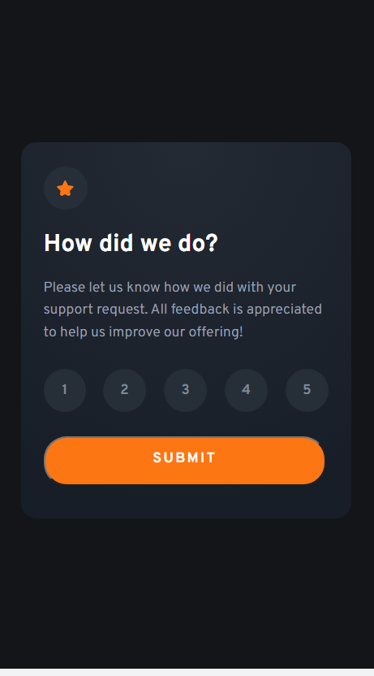
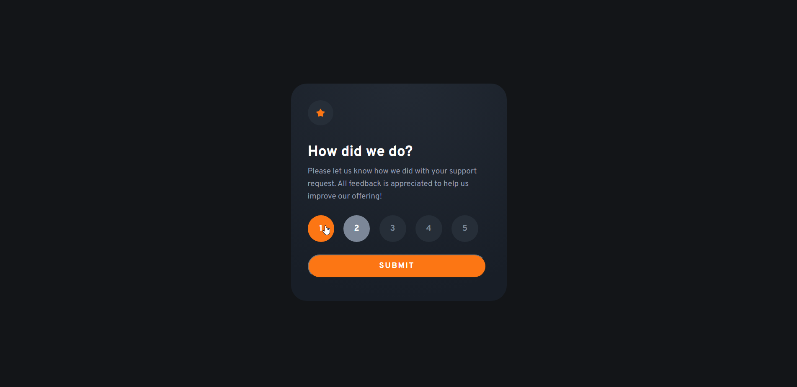
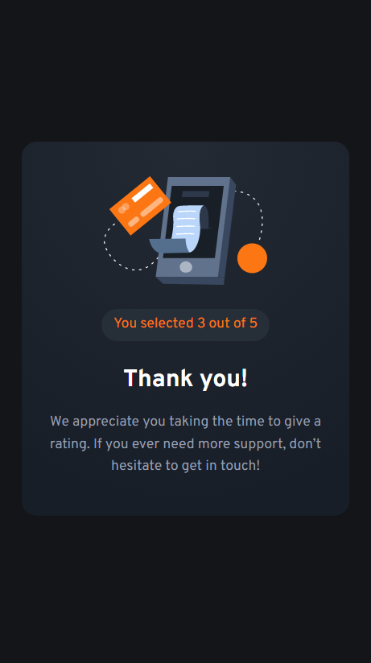
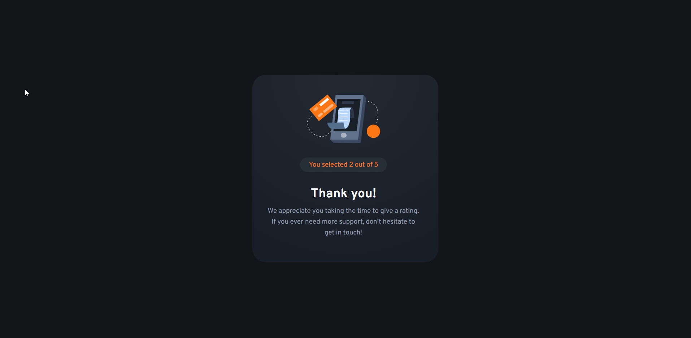

# Interactive rating component solution

## Table of contents

- [Overview](#overview)
  - [The challenge](#the-challenge)
  - [Screenshot](#screenshot)
  - [Links](#links)
- [My process](#my-process)
  - [Built with](#built-with)

## Overview

A simple rating component. I used ReactJS just to practice my skills.

### The challenge

Users should be able to:

- View the optimal layout for the app depending on their device's screen size
- See hover states for all interactive elements on the page
- Select and submit a number rating
- See the "Thank you" card state after submitting a rating

### Screenshot

### Links

- Solution URL: [https://www.frontendmentor.io/solutions/interactive-rating-component-reactjs-html-js-css-mobile-first-BJQ7yK1Sc](https://www.frontendmentor.io/solutions/interactive-rating-component-reactjs-html-js-css-mobile-first-BJQ7yK1Sc)
- Live Site URL: [https://super-snickerdoodle-387313.netlify.app/](https://super-snickerdoodle-387313.netlify.app/)

## My process
1. Write the JSX.
2. Style the CSS.
3. Add the active styles.
4. Add the state and props.
5. Write readme.

### Built with

- Semantic HTML5 markup
- CSS
- Mobile-first workflow
- [React](https://reactjs.org/) - JS library

